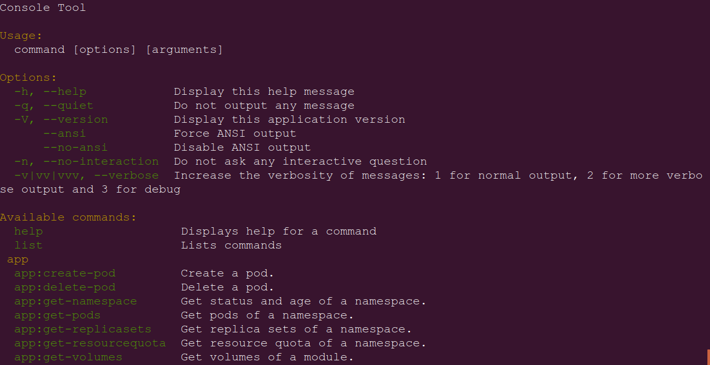
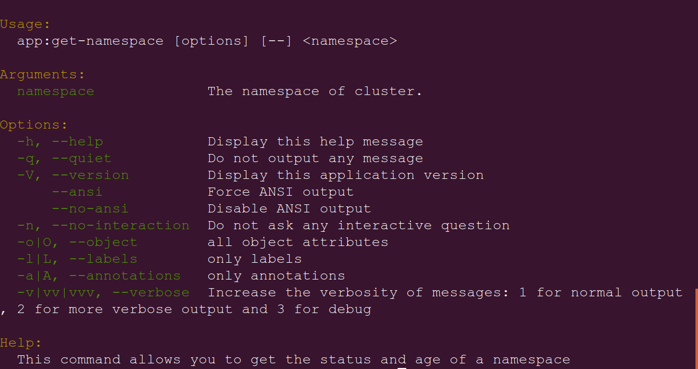
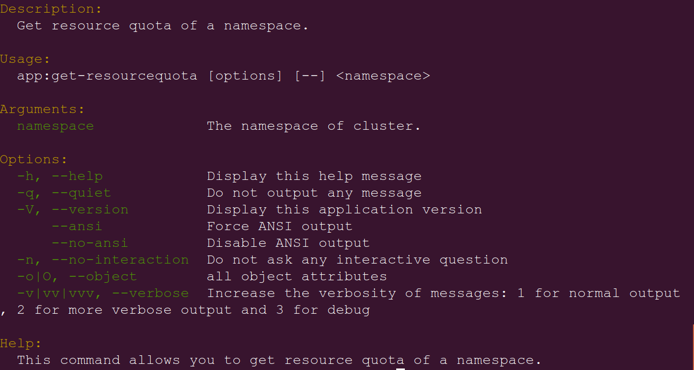
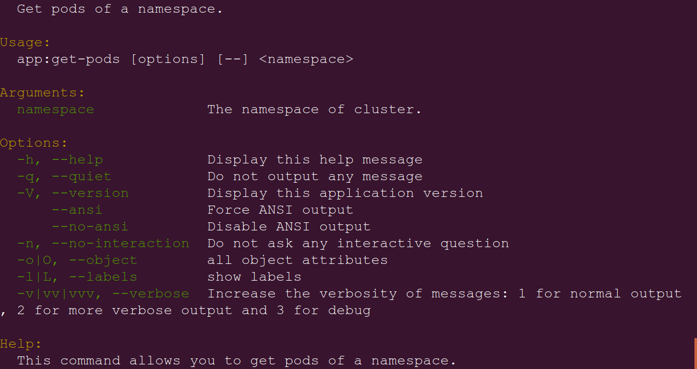

# pkc (PHP Kubectl)

## Use

### Linux distributions

If php is installed in `/usr/bin`, you can run direclty

```bash
pkc.phar
```
Alternatively, you can run

```bash
php pkc.phar
```
or create a symlink to your php in `/usr/bin`.

You can move pkc.phar to /usr/bin as pck, so you can run it as a command:

```bash
pkc
```

### Windows

if php.exe is declared in PATH environment variable, you can run it so:

```
php.exe pkc.phar
```

You can create a .BAT file that contains this call.

## Commands 

*samplenamespace* is the variable argument that you must provide, a Kubernetes valid namespace.

### app:get-namespace

**Input:**

```bash
pkc.phar app:get-namespace samplenamespace
```
**Output:**

```bash
Namespace samplenamespace is Active and has 14d
```

### app:get-resourcequota

**Input:**

```bash
pkc.phar app:get-resourcequota samplenamespace
```
**Output:**

```bash
Namespace samplenamespace was created at 2019-08-22T16:05:00Z
```

### app:get-pods

**Input:**

```bash
pkc.phar app:get-pods samplenamespace
```
**Output:**

```bash
Namespace samplenamespace
pod=podsample1 ready=1/1 status=Running restarts=0 age=6d11h
pod=podsample2 ready=1/1 status=Running restarts=0 age=6d11h
pod=podsample3 ready=1/1 status=Running restarts=0 age=6d11h
```
  
## Build

First, change **phar.readonly** to **Off**

Then, run 

```bash
vendor/bin/phing
```

Finally, change **phar.readonly** to **On** **[DON'T FORGET IT]**

## Screenshots

**pkc.phar** no arguments



**pkc.phar app:get-namespace**



**pkc.phar app:get-resourcequota**



**pkc.phar app:get-pods**


